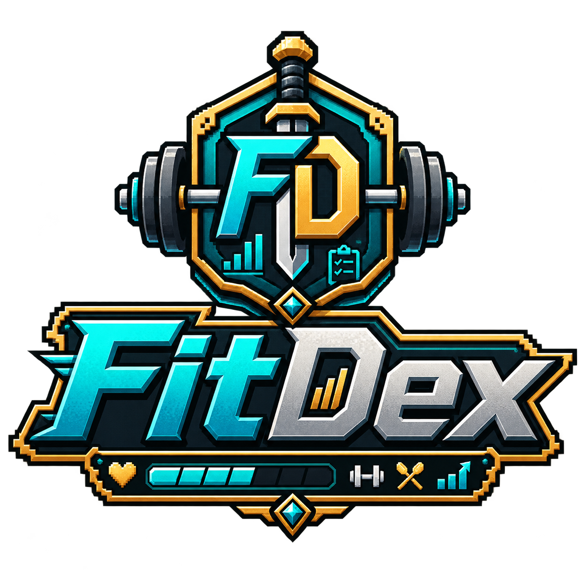
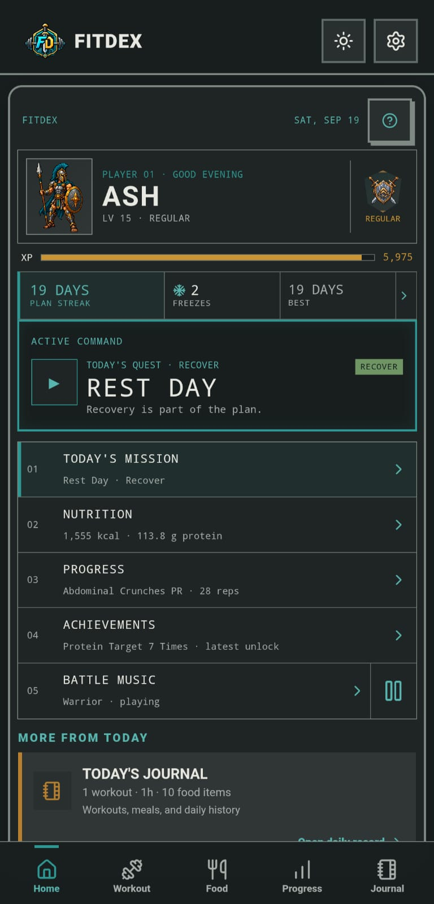
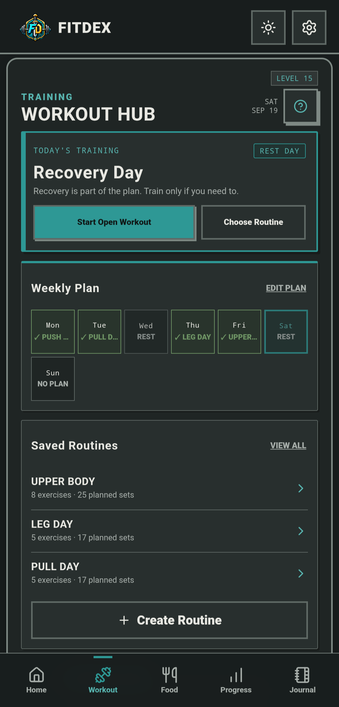
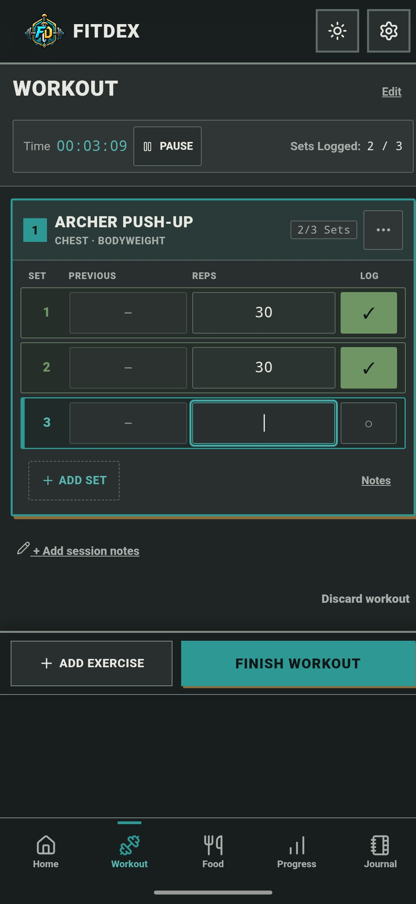
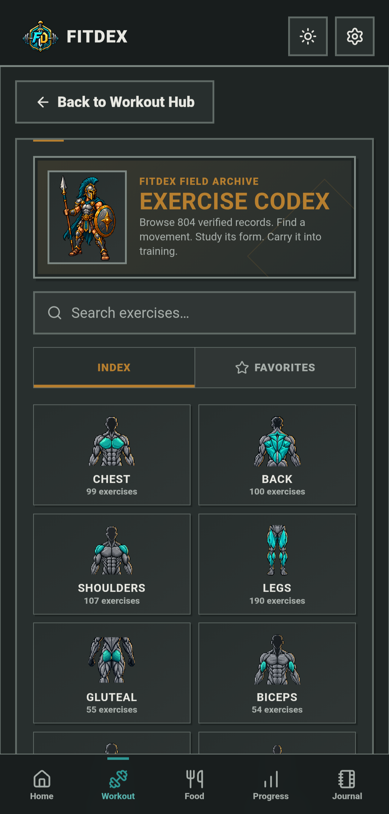
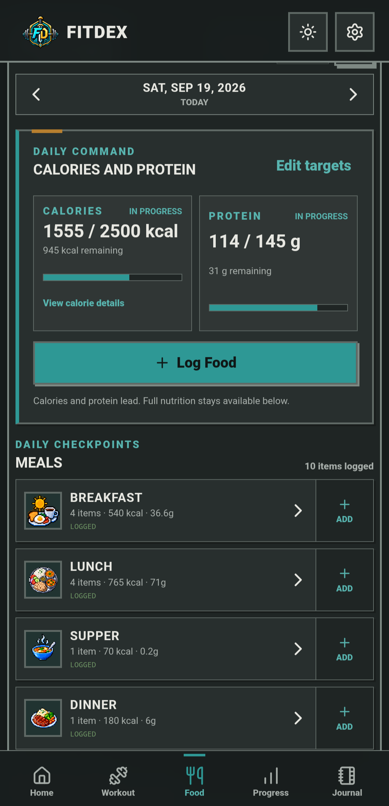
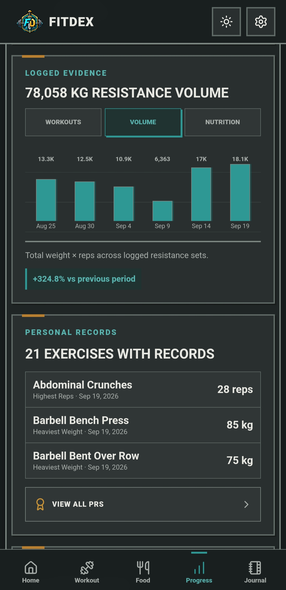

<div align="center">
  

  # FitDex

  **Train. Track. Level Up.**

  A local-first Android fitness tracker built like a retro RPG.

  [](https://github.com/ArijitWayne/fitdex)
  [-1f8582?style=flat-square)](https://github.com/ArijitWayne/fitdex)
  [](package.json)
  [](https://fitdex.fitdexapp.workers.dev/)
  [-blue?style=flat-square)](LICENSING.md)

  <br />

  <p align="center">
    <a href="#why-i-built-fitdex">Why I Built FitDex</a> •
    <a href="#download">Download</a> •
    <a href="#screenshots">Screenshots</a> •
    <a href="#core-features">Core Features</a> •
    <a href="#how-fitdex-works">Architecture</a> •
    <a href="#installation">Installation</a> •
    <a href="#data--privacy">Data & Privacy</a> •
    <a href="#development-setup">Development</a> •
    <a href="#contributing">Contributing</a> •
    <a href="#license">License</a>
  </p>
</div>

---

FitDex pairs serious strength and nutrition tracking with the spirit, progression, and tactile feel of a retro handheld RPG.

Log workouts, organize recurring routines, reference exercise mechanics, track daily nutrition targets, and earn XP toward character ranks—all stored directly on your own device with zero account requirements, zero cloud tracking, and complete offline capability.

---

## Why I Built FitDex

Fitness and staying healthy shouldn't feel like something you have to keep paying for.

There are more fitness trackers, calorie counters, habit apps, and gamified wellness platforms than ever before. Many of them are excellent products, but they often share the same pattern: the features that become most useful as you progress eventually sit behind subscriptions, premium tiers, or recurring payments.

I wanted something different.

FitDex was born from the idea that a complete fitness companion could combine training, nutrition, consistency, progress tracking, and game-like motivation without asking you to subscribe just to keep improving.

FitDex is designed to be **free to use**, **local-first**, and controlled by the person whose data matters most: **you**.

### Your Data Stays on Your Device

Personal fitness data is intimate. In FitDex, your:
- Workouts, exercises, sets, reps, and logged weights
- Recurring routines and weekly training plans
- Food logs, meal history, and custom nutrition targets
- Personal records (PRs), analytics, and journal entries
- RPG level, XP progression, rank history, and achievement unlocks
- Display name, theme selections, and custom preferences

live directly on your device in local storage (IndexedDB via Dexie). There are no required cloud accounts, no centralized user databases, and no hidden tracking scripts. When you need to move to a new device, you can export and import complete, portable `.fitdex` backup files anytime.

*(Note: While user data is strictly local, exercise demonstration videos are streamed or selectively downloaded on-demand from the remote FitDex media service to keep the initial app package compact.)*

### More Than a Passive Notebook: A Strict Companion

FitDex is designed to behave less like a passive notebook and more like a dedicated training companion that remembers what you committed to and encourages you to keep showing up:

- **Workout Tracking:** Build recurring routines, log variable resistance sets with previous-performance recall, run auto-saving session timers with zero-exercise safeguards, and take advantage of automated rest timers.
- **Weekly Plan:** Transform good intentions into structured training days.
- **Plan Streaks:** Track adherence to the workouts you actually scheduled, rather than rewarding meaningless daily app opens.
- **Streak Freezes:** Earn limited, meaningful protection when life gets in the way, avoiding both harsh discouragement and unlimited artificial forgiveness.
- **Travel & Sickness Pause:** Pause your active schedule during legitimate breaks without corrupting your training momentum or recording false missed sessions.
- **Exercise Dex:** Search 804 built-in movements across 9 muscle categories with detailed execution instructions, anatomical target cards, and video demonstrations.
- **Food & Nutrition Codex:** Track meals, daily calories, and full macronutrient breakdowns with customizable targets—without a premium paywall.
- **Progress & Personal Records:** Review calculated training volume, resistance workload, weekly consistency, macro adherence, and an all-time PR ledger.
- **RPG Progression & Audio:** Earn XP, climb through 9 player ranks from Novice to Immortal, unlock 52 milestone achievements, and train with dynamic retro 8-bit sound effects and battle music soundtracks.

The goal isn't to replace discipline with gamification.

The goal is to make discipline easier to maintain.

**Train. Track. Level Up.**

---

## Download

> [!NOTE]
> Public Android release packaging is currently being prepared under Phase 3 (Signed Android Release System). Official signed APK packages will be downloadable directly from [GitHub Releases](https://github.com/ArijitWayne/fitdex/releases).

Future release packages will follow standard naming:

```text
fitdex.<version>.apk
Example: fitdex.1.0.0.apk
```

In the interim, you can test the production web shell as an installable Progressive Web App:

- **Live Web App / PWA:** [https://fitdex.fitdexapp.workers.dev/](https://fitdex.fitdexapp.workers.dev/)

---

## Screenshots

FitDex pairs high-density training and nutrition tracking with the tactile feel of a retro handheld RPG:

<table align="center">
  <tr>
    <td align="center" width="50%">
      <strong>Home</strong><br /><br />
      
    </td>
    <td align="center" width="50%">
      <strong>Workout Hub</strong><br /><br />
      
    </td>
  </tr>
  <tr>
    <td align="center" width="50%">
      <strong>Active Workout</strong><br /><br />
      
    </td>
    <td align="center" width="50%">
      <strong>Exercise Dex</strong><br /><br />
      
    </td>
  </tr>
  <tr>
    <td align="center" width="50%">
      <strong>Nutrition</strong><br /><br />
      
    </td>
    <td align="center" width="50%">
      <strong>Progress</strong><br /><br />
      
    </td>
  </tr>
</table>

---

## Core Features

### 🏋️ Workout & Routine Hub
- **Reusable Routines:** Build multi-day workout templates with planned set counts and target metrics.
- **Flexible Logging:** Start from a predefined routine or launch an open workout session. Active workouts persist across app restarts.
- **Workout Timer:** Runs during active training with automatic elapsed-time tracking. Guarded so empty workouts cannot accumulate phantom training time.
- **Rest Timer:** Dedicated post-set countdown timer with audio chime upon completion.
- **Performance History:** Review past set weight and repetitions directly within the active logging view. Completed workouts are stored as immutable snapshots.

### 📖 Exercise Dex
- **804 Built-in Exercises:** Searchable library covering 9 anatomical categories (Chest, Back, Shoulders, Legs, Gluteal, Biceps, Triceps, Forearms, Abs).
- **Anatomical Cards & Execution Instructions:** Detailed execution steps, primary/secondary muscle targets, and equipment tags.
- **Selective Video Demos:** Stream exercise video demonstrations online or selectively download videos to local storage on Android to conserve data.
- **Favorites & Fast Filtering:** Filter by muscle category, search with normalized punctuation, and maintain local quick-access lists.

### 🥗 Food & Nutrition Codex
- **Meal Organization:** Log food across Breakfast, Lunch, Supper, and Dinner.
- **Full Macro Tracking:** Calories, protein, carbohydrates, fats, fiber, sugar, saturated fat, and sodium.
- **Calorie Donut Breakdown:** Dual-mode visualization displaying calorie contribution by macro or by meal.
- **Nutrition Targets:** In-app target calculator utilizing Mifflin–St Jeor baseline energy expenditure with adjustable activity and goal modifiers.
- **Quick-Log & Memory:** Frequently logged items and custom meal templates save locally for rapid entry.

### ⚔️ Progression & RPG System
- **Player Character Progression:** Earn XP through completed workouts, verified personal records (PRs), fully logged nutrition days, and achievement milestones (+50 XP per unlock).
- **Ranks & Levels:** Advance from Level 1 to 100 through 9 ascending ranks (Novice, Apprentice, Warrior, Veteran, Centurion, Champion, Warlord, Conqueror, Immortal).
- **Weekly Schedule & Streak Protection:** Build streaks through your planned training schedule. Includes automatic Streak Freezes (earned every 15 planned days) and a dedicated Travel/Sickness Pause mode.
- **52 Achievements:** Milestone achievements spanning strength volume, workout consistency, nutrition fidelity, and dex exploration.

### 🎨 Themes, Audio & Aesthetics
- **Theme Families:** Spartan and Amazonian visual identities, each offering Light and Dark variants.
- **Adaptive Android Launcher Icons:** Android shell dynamically updates its launcher emblem to match the active faction theme.
- **Audio Soundscapes:** 4 semantic sound effects (`select`, `add`, `achievements_unlock`, `progress_complete`) and 3 looping retro background tracks (Warrior, Hardened, Villain) with independent volume/mute controls.

---

## How FitDex Works

FitDex separates mutable configuration templates from immutable historical activity logs:

```text
┌───────────────────────────┐         ┌───────────────────────────┐
│     Editable Models       │         │   Historical Snapshots    │
├───────────────────────────┤         ├───────────────────────────┤
│ • Routines                │ ──────> │ • Completed Workouts      │
│ • Weekly Training Plan    │         │ • Personal Records (PRs)  │
│ • Custom Food Templates   │ ──────> │ • Daily Nutrition Logs    │
│ • Active Workout (Draft)  │         │ • Journal / Field Notes   │
└───────────────────────────┘         └───────────────────────────┘
```

Modifying or deleting a routine, remembered food, or category template never alters or corrupts historical completed workouts or previous food log entries.

---

## Installation

### Android (Recommended)
FitDex is packaged as an Android application via Capacitor.

1. Download the latest `fitdex.<version>.apk` from [Releases](https://github.com/ArijitWayne/fitdex/releases).
2. Open the downloaded APK on your Android device.
3. When prompted by Android, grant permission to install from your browser or file manager ("Install unknown apps").
4. Review system installation details and tap **Install**.
5. Launch **FitDex** from your home screen or app drawer.

> [!NOTE]
> Because FitDex is distributed directly outside the Google Play Store, Android will display standard security prompts for sideloaded packages.

### Web App (PWA)
FitDex can also be run in any modern web browser or installed as a standalone Progressive Web App:

1. Navigate to [https://fitdex.fitdexapp.workers.dev/](https://fitdex.fitdexapp.workers.dev/).
2. In Chrome or your browser menu, select **Install FitDex** or **Add to Home Screen**.

---

## Updating

When a new version is released:

1. Download the newer `fitdex.<version>.apk`.
2. Install it directly over your existing installation. Android will update the application binary while preserving your local database and settings.
3. *Recommendation:* Before performing major version upgrades, export a `.fitdex` backup via **Settings → Data & Storage**.

---

## Data & Privacy

Privacy is a core design commitment in FitDex:

- **Local Storage:** All workout sessions, food logs, personal notes, and progress metrics are stored strictly on your device using IndexedDB (via Dexie).
- **Zero Cloud Accounts:** You do not need an email, password, or account to use any feature. FitDex does not operate a centralized user database.
- **Zero Tracking:** No third-party tracking scripts, advertising trackers, or behavior profiling SDKs are present in the application.
- **Static Media vs. User Data:**
  - *User Data:* 100% device-local.
  - *Static Media:* Exercise demonstration videos may be streamed on-demand or downloaded over HTTPS from a remote content delivery network. Video downloads are stored within private app storage and cleared on uninstallation.

---

## Backup & Restore

You own your data completely. You can export and import your full history at any time:

1. Navigate to **Settings → Loadout & System → Data & Storage**.
2. Tap **Export Backup** to save a portable `.fitdex` file containing your full database (routines, workout history, food logs, PRs, achievements, settings).
3. Tap **Import Backup** to restore data onto a new device. Restoring requires explicit confirmation and completely replaces current local state with the verified backup payload.

---

## Tech Stack

| Layer | Technology | Description |
| :--- | :--- | :--- |
| **Frontend Framework** | [React 19](https://react.dev/) + [TypeScript](https://www.typescriptlang.org/) | Type-safe UI and reactive state modeling |
| **Build & Tooling** | [Vite](https://vitejs.dev/) + [Oxlint](https://oxc.rs/) | Fast ESM development server, bundling, and linting |
| **Local Database** | [Dexie.js](https://dexie.org/) (IndexedDB) | Reactive, schema-versioned client-side database |
| **Native Android Shell** | [Capacitor 8](https://capacitorjs.com/) | Android WebView bridge and native launcher controls |
| **Styling** | Vanilla CSS Design Tokens | High-performance CSS variables, zero runtime overhead |
| **Iconography** | [Lucide React](https://lucide.dev/) | Clean interface iconography paired with custom pixel art |
| **PWA Engine** | [Workbox](https://developer.chrome.com/docs/workbox) | Service worker caching for offline app shell |

---

## Development Setup

### Prerequisites
- [Node.js](https://nodejs.org/) (v20+ recommended)
- `npm` (v10+)
- For Android builds: [Android Studio](https://developer.android.com/studio), Android SDK Platform 34+, and JDK 17+

### Local Web Development
```bash
# Clone the repository
git clone https://github.com/ArijitWayne/fitdex.git
cd fitdex

# Install dependencies
npm install

# Start local development server
npm run dev
```

Visit `http://localhost:5173` in your browser.

### Building & Verification
```bash
# Type check and production web build
npm run build

# Run fast code linting
npm run lint

# Run automated test suites
npm run test:workout-sessions
npm run test:exercise-dex
npm run test:food
npm run test:nutrition-targets
npm run test:weekly-plan
npm run test:gamification
```

### Android Development
```bash
# Sync web assets to the Android Capacitor project
npm run android:sync

# Assemble a local debug APK
npm run android:build
```
The compiled debug APK will be generated at `android/app/build/outputs/apk/debug/app-debug.apk`.

---

## Project Status & Roadmap

FitDex is under active development. Current focus areas:

- **Current Focus:**
  - Android release infrastructure and reproducible signed release builds
  - Screenshot and visual brand showcase
  - Offline media management polish
  - Physical phone ergonomic refinement

- **Future Roadmap:**
  - In-app update notifications for new GitHub Releases
  - Dedicated documentation and showcase landing site
  - Enhanced body measurement and trend visualizations

---

## Contributing

Contributions from the community are welcome! Please review [CONTRIBUTING.md](CONTRIBUTING.md) for development workflows, coding standards, branch conventions, and testing requirements before opening a pull request.

---

## Security

For security vulnerability reports or responsible disclosure, please review our [Security Policy](SECURITY.md).

---

## License

FitDex is source-available software distributed under a split licensing model.

| Area / Path | License | Summary |
| :--- | :--- | :--- |
| **Core Application**<br>`src/**`, `android/**` | [PolyForm Noncommercial 1.0.0](LICENSES/PolyForm-Noncommercial-1.0.0.md) | Source-available for personal, educational, and noncommercial use. |
| **Public Docs & Tooling**<br>`docs/**`, `scripts/**`, `.github/**`, config | [MIT License](LICENSES/MIT.txt) | Permissive open-source reuse with attribution. |
| **Branding & Visual Media**<br>`public/**`, `src/assets/**` | [Separate Terms](ASSETS.md) | All Rights Reserved. FitDex logos, avatars, and badges are not licensed for reuse. |
| **Exercise Media**<br>`/exercises/*.mp4` | [Separate Media Terms](ASSETS.md) | Distributed separately; rights vary by asset. |

Commercial use of PolyForm-covered FitDex code requires separate permission from the copyright holder.

For complete licensing details and boundary definitions, see [LICENSING.md](LICENSING.md) and [ASSETS.md](ASSETS.md).

---

## Community & Links

- **Repository:** [https://github.com/ArijitWayne/fitdex](https://github.com/ArijitWayne/fitdex)
- **Web Application:** [https://fitdex.fitdexapp.workers.dev/](https://fitdex.fitdexapp.workers.dev/)
- **Design Guidelines:** [docs/FITDEX_UI_UX_STANDARD.md](docs/FITDEX_UI_UX_STANDARD.md)
